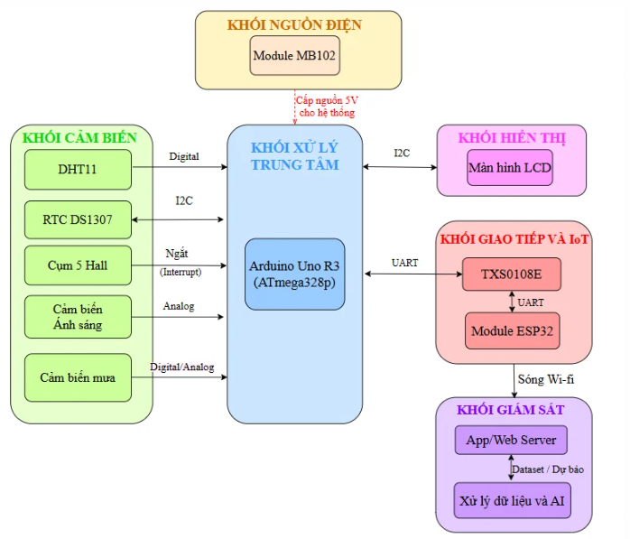
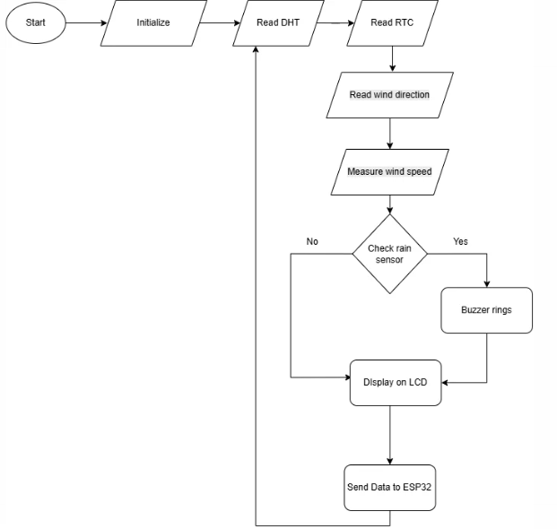
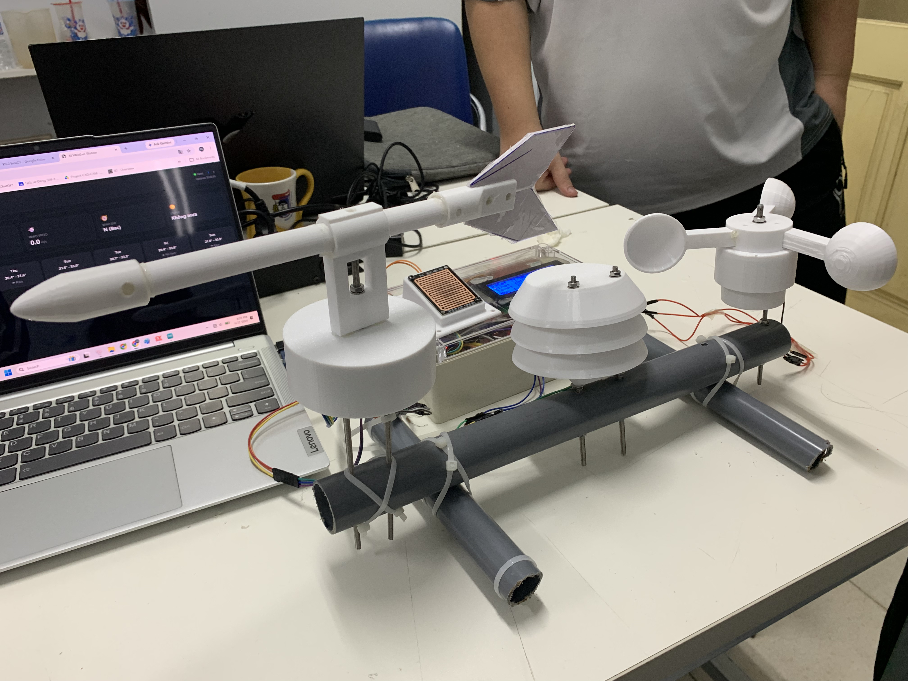

#XÂY DỰNG HỆ THỐNG QUAN TRẮC VÀ DỰ BÁO THỜI TIẾT IOT

## 📌 Giới thiệu dự án
Dự án tập trung nghiên cứu, thiết kế và chế tạo một trạm thời tiết nhằm tự động hóa quy trình quan trắc khí tượng. Hệ thống kết hợp khả năng xử lý phần cứng tối ưu ở lớp dưới (bare-metal), giải pháp truyền thông không dây linh hoạt (Gateway) và phân tích thông minh dựa trên mô hình toán học để đưa ra các kịch bản dự báo thời tiết ngắn hạn.

Bài toán khí tượng được tiếp cận dưới dạng **hồi quy tuyến tính có kiểm soát thành phần phạt (Ridge Regression)** nhằm giải quyết triệt để hiện tượng đa cộng tuyến của dữ liệu khí tượng bề mặt.

---

## 📐 Kiến trúc chức năng & Luồng xử lý

### 1. Sơ đồ khối chức năng hệ thống
Dưới đây là sơ đồ mô tả mối quan hệ, các liên kết phần cứng và luồng giao tiếp dữ liệu giữa khối xử lý trung tâm ATmega328P, khối truyền thông ESP32 và các module cảm biến môi trường.



### 2. Lưu đồ thuật toán vận hành
Lưu đồ thể hiện chu trình hoạt động khép kín của trạm, từ giai đoạn khởi tạo cấu hình thanh ghi, quét ngắt ngoại vi, thu thập dữ liệu từ cảm biến, đóng gói dữ liệu truyền nhận đến phân tích hồi quy và cập nhật kết quả hiển thị.



### 3. Hình ảnh sản phẩm thực tế
Hình ảnh mô hình trạm vật lý thu nhỏ hoàn thiện sau khi đã tích hợp phần cứng, các module cảm biến khí tượng, mạch chuyển đổi mức logic và hệ thống hiển thị trực quan.



---

## 🎯 Mục tiêu đề tài

- **Tối ưu hóa phần cứng lớp dưới:** Sử dụng vi điều khiển chính ATmega328P, lập trình tương tác trực tiếp với các thanh ghi qua môi trường CodeVisionAVR nhằm tối ưu hóa bộ nhớ, tăng tốc độ xử lý ngắt và tiết kiệm điện năng vận hành.
- **Xây dựng giải pháp giao tiếp không dây:** Sử dụng ESP32 (lập trình trên Arduino IDE) làm Gateway nhận gói dữ liệu từ vi điều khiển chính và đồng bộ luồng thông tin lên máy chủ trung tâm qua Wi-Fi.
- **Tích hợp mô hình dự báo thông minh:** Xây dựng chương trình tính toán độc lập trên nền tảng Python, áp dụng thuật toán học máy Hồi quy Ridge để huấn luyện dữ liệu, phân tích xu hướng biến động nhằm đưa ra kịch bản dự báo thời tiết ngắn hạn, sau đó nạp dữ liệu phản hồi ngược lại cho vi điều khiển hiển thị lên màn hình.

---

## 🛠 Thư viện & Công nghệ sử dụng

| Thành phần | Công nghệ / Thư viện | Vai trò trong dự án |
|---|---|---|
| **Vi điều khiển chính** | ATmega328P & CodeVisionAVR | Thu thập dữ liệu cảm biến, quản lý ngắt, hiển thị kết quả, tối ưu thanh ghi phần cứng. |
| **Giao tiếp ngoại vi** | TWI/I2C phần cứng (`TWI_Lib2.h`) | Quét dữ liệu tốc độ cao từ cảm biến và màn hình LCD. |
| **Truyền thông Gateway** | ESP32 & Arduino IDE | Nhận dữ liệu từ ATmega328P, đồng bộ không dây lên máy chủ trung tâm. |
| **Giao diện cấu hình** | Web Server tĩnh (`web_ui.h`) | Khởi tạo điểm truy cập (AP) và giao diện cấu hình Web UI cục bộ trên ESP32. |
| **Thuật toán Học máy** | Python & Ridge Regression (L2) | Huấn luyện mô hình hồi quy, khắc phục hiện tượng đa cộng tuyến, xuất trọng số. |
| **Nhúng toán học** | Trọng số tĩnh (`model_weights.h`) | Lưu trữ ma trận weights & bias đã huấn luyện để vi điều khiển tính toán dự báo trực tiếp tại chỗ. |

---

## 📂 Phân tích cấu trúc mã nguồn (Firmware)

Hệ thống thư viện và trình điều khiển được tối ưu hóa tối đa dung lượng để chạy trên kiến trúc AVR:
* **Chương trình chính:** `TramThoiTiet.c` điều khiển toàn bộ luồng xử lý luân phiên và xử lý ngắt. Các file cấu hình hệ thống bao gồm `TramThoiTiet.prj`, `TramThoiTiet.atsln`, `TramThoiTiet.cfg`.
* **Trình điều khiển giao tiếp nền tảng:** * `TWI_Lib2.h`: Cấu hình bộ mã hóa giao tiếp I2C phần cứng.
  * `UART_Lib.h`: Quản lý truyền nhận nối tiếp tốc độ cao để đẩy gói dữ liệu sang ESP32.
  * `ADC_Lib.h`: Cấu hình bộ chuyển đổi tương tự - số, đọc các cảm biến dạng điện áp analog.
* **Trình điều khiển cảm biến khí tượng:**
  * `dht11_lite.h`: Đọc dữ liệu nhiệt độ và độ ẩm môi trường (bản lite tối ưu dung lượng).
  * `rain_sensor.h`: Đo lường và xác định trạng thái lượng mưa tích tụ.
  * `hall_speed.h`: Xử lý tín hiệu ngắt từ cảm biến Hall để tính toán vận tốc gió (anemometer).
  * `wind_dir.h`: Xác định hướng gió thông qua bộ phân bậc điện áp ADC.
  * `lcd2004_i2c.h`: Điều khiển xuất màn hình hiển thị LCD 20x4 qua IC chuyển đổi I2C.

---

## ⚠️ Những khó khăn gặp phải

- **Giới hạn tài nguyên phần cứng:** Vi điều khiển ATmega328P có dung lượng bộ nhớ RAM và Flash rất nhỏ, đòi hỏi phải lập trình can thiệp thanh ghi trực tiếp để tối ưu hóa thay vì dùng các thư viện Arduino cồng kềnh.
- **Hiện tượng đa cộng tuyến:** Các biến số khí tượng bề mặt (nhiệt độ, áp suất, độ ẩm) có mối tương quan tuyến tính rất mạnh với nhau, dễ gây sai số lớn cho các mô hình hồi quy tuyến tính thông thường.
- **Tối ưu tham số phạt (`alpha`):** Phải thực hiện tinh chỉnh tham số Regularization phù hợp cho thuật toán Hồi quy Ridge trên Python trước khi trích xuất trọng số nhúng xuống chip.

---

## 📍 Phạm vi nghiên cứu & Hướng phát triển

### Phạm vi nghiên cứu
- **Không gian thực nghiệm:** Tập trung thu thập và đối sánh luồng dữ liệu thời tiết thực tế tại khu vực **Hà Nội**. Dữ liệu từ trạm IoT tự chế được so sánh trực tiếp với các trạm đo lường chính thống cùng khu vực để hiệu chuẩn sai số.
- **Giới hạn thuật toán:** Chỉ tập trung phân tích sâu vào thuật toán hồi quy tuyến tính có kiểm soát thành phần phạt là **Hồi quy Ridge (L2 Regularization)** để khắc phục hiện tượng đa cộng tuyến, không mở rộng sang các kiến trúc học sâu phức tạp khác nhằm bảo toàn tài nguyên tính toán của hệ thống nhúng.

### Hướng phát triển
- Tích hợp thêm các cảm biến khí tượng chuyên dụng khác (đo chỉ số UV, bụi mịn PM2.5).
- Mở rộng hệ thống Web Server trên Cloud để trực quan hóa biểu đồ lịch sử khí tượng theo thời gian thực một cách toàn diện hơn.

---

## 🚀 Cài đặt và chạy dự án
### Clone Repository

```bash
git clone [https://github.com/phuonganh-hus/iot_weather_station_ridge_regression.git](https://github.com/phuonganh-hus/iot_weather_station_ridge_regression.git)
cd iot_weather_station_ridge_regression
